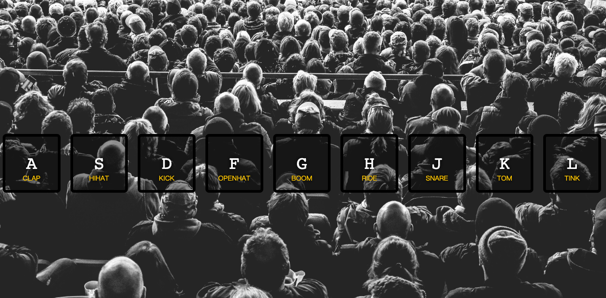

# 01 - JavaScript Drum Kit



## 主題:

1. 透過鍵盤按下鍵盤特定鍵,會產生音效
2. 在按下其他鍵後會關閉特效, 特效在新按鍵中啟用

## 步驟:

### Step1: 
在window中建立監聽`window.addEventListener('keydown', playSound)`

### Step2: 
實做出playSound, 這邊要選取audio的標籤出來
`var audio = document.querySelector(`audio[data-key="${e.keyCode}"]`)`
直接透過`audio.play()`, 這樣聲音就有了. 

但是比較有問題的是, 只能響一次, 沒有辦法連續, 因為對play來說, 只要執行一次就好
所以還要加上`audio.currentTime = 0`

這時候我在鍵盤上輸入相對應的值, 那就會發出相對應的聲音

### Step3:
特效效果的建立是在key上, 所以先選取所有的key
`var key = document.querySelector(`.key[data-key="${e.keyCode}"]`)`
這部分是用`addClass`來實作, 但是問題是當一`add`以後, 就無法消失了
若是用`toggleClass`那還要再按一次key, 效果才會消失, 這樣都答不到效果

當該元件觸發特效並結束時, 可以透過監聽`transitionend`事件

要監聽這個事件, 是要針對所有的key. 
因此要先選取所有的key, 再透過forEach來委派監聽
`var keys = document.querySelectorAll('.keys')`
`keys.forEach(key => key.addEventListener('transitionend', removeTransition))`

### Step4:

實作出`removeTransition`
判斷傳入的propetryName是否為transform, 若否則退出
若為transform, 則移除playing


## JavaScript語法&備註

### HTMLmediaElement(audio)

HTML的audio標籤，在HTML放置如下標籤指定音源
```htmlmixed=
<audio src="sound/a.mp3"></audio>
```

透過javascript來操作：  
element.play():進行播放  
element.currentTime:指定播放秒數  
範例中使用currentTime是為了達到連發的效果XD

### forEach

這一次對forEach有更深的體悟, 先選取一個大集合的陣列, 針對陣列裡面所有的item可以做同步操作, 例如說

1. 每一個item都加1
2. 每一個item都加上`addEventListener`. 
3. forEach無法return 

### addEventListener

MDN中有記錄所有的HTML DOM EVENT 
> 連結 [MDN-Event reference](https://developer.mozilla.org/en-US/docs/Web/Events)

### querySelectorAll補充

在自己實作的過程中, 有發現`querySelectorAll`回傳出來為`nodelist`, 這是類陣列, 不是一般的陣列用法, 因此直接用push會報錯. 底下提供兩種轉為陣列的用法. 

```javascript=
let testNodeList = document.querySelectAll('.key');
testNodeList.push('add'); // <--非陣列會報錯TypeError: testNodeList.push is not a function

//方法一:
let testArray = Array.from(testNodeList);
testArray.push('add'); // <-- 轉為陣列就可以了

//方法二:
let testArray = [...testNodeList]
testArray.push('add'); // <-- 轉為陣列就可以了
```

## CSS語法&備註

這邊一開始讓我實做不出來的是, 如何做出垂直置中
因為沒有高度, 所以align-items會無法作用

vh: view height  
vw: view width 

這兩個單位的使用上和百分比很類似，當我填100vh和100vw時，意思就是我的這個div要是整個螢幕的可是範圍，而且很重要的是，這個區塊會隨著瀏覽器的縮放而改變。

```css=
height:100vh;
display: flex;
align-items:center;//垂直置中
justify-content: space-around;
```

## 探索
加上事件點擊. 所以要針對所有的key加上`addEventListener`的監聽, 監聽click事件. 
另外除了針對e.keyCode以外, 還要可以拿到點擊當下的keyCode

```javascript=
var keys = document.querySelectAll('key')

keys.forEach(key => key.addEventListener('click'), function(e){
    var keyCode = this.dataset.key || e.keyCode
    var audio = document.querySelector(`audio[data-key=${keyCode}]`)
    audio.currentTime = 0
    audio.play()
})
```