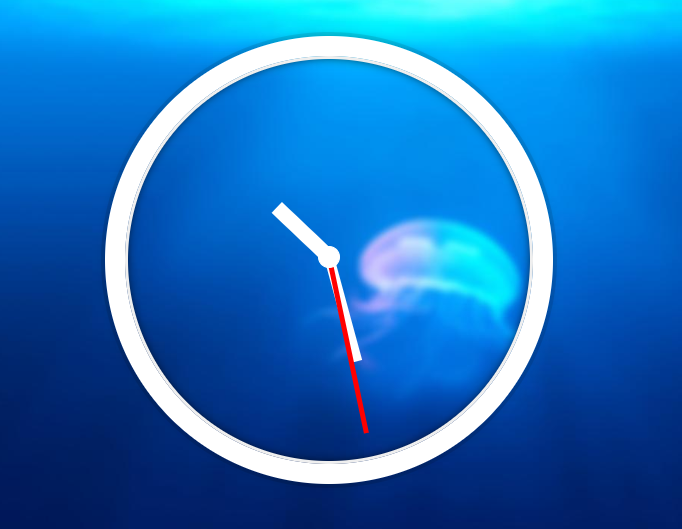

# CSS-CLOCK



## 主題:

自製與時並進的css clock

## 步驟:

### Step1: 
製作中心點, 並分別對秒針, 分針, 時針做定位和樣式

### Step2:
利用 setInterval(setDate, 1000);每秒取得當前時間

### Step3:
透過`new Data()`,取得現有秒數, 分數, 時數, 並計算角度
並透過`element.style.transform = rotate(${xxx}deg)`
產生位移的效果

## JavaScript語法&備註

### new Date()

取得時間的函數，一定要搭配new來使用new Date()
date.getSeconds()：取得當前秒
date.getMinutes()：取得當前分鐘
date.getHours()：取得當前小時
### 立即函式

把函式封裝不外露, 而前面加上`;`是因為怕和別的函數寫在一起

```javascript=
;(function(){
	// do somthing 
}())
```
### 計時器方面函式

`設定一次執行很多次, 常用來做輪播`
- setInterval(setData, 1000) 

`timeout就是暫停, 概念比較像是延遲`
- setTimeout(handleTimer, 1000)

```javascript=
function handleTimer(){ 
    setData()
    setTimeout(handleTimer, 1000) //在callback一次這個function, 讓他可以持續執行, 不加上這一行, 只會執行一次
}
```

`處理畫面更新的setTimeout, 依照畫面來決定多久更新一次`
- window.requestAnimationFrame(animantionHandler)

```javascript=
function animantionHandler(){
  setData() 
  window.requestAnimationFrame(animantionHandler)
}
```

> [mdn補充](https://developer.mozilla.org/zh-TW/docs/Web/API/Window.requestAnimationFrame)

### 計算角度

這部分不用想的太複雜. 
一圈360度. 

秒針: 一秒走一格, 一共有60格, 因此每一格為360/60 = 6 (動一格增加6度)  

分針: 一分鐘走一格, 一共也有60格, 因此每一格為360/60 = 6 (動一格增加6度)  

時針: 一小時走一格, 一共有12格, 因此每一格為360/12 = 30 (動一格增加30度)


```javascript=
const secondsDegree = now.getSeconds() * 6
const minDegree = now.getMinutes() * 6
const hourDegree = now.getHours() * 30
```

但是這樣沒辦法完全體現出時鐘, 例如我的時針不會從完全不動, 一次移動30度到下一個小時, 每過幾分鐘, 時針還是有初略變化的. 

所以小時和小時之間的分鐘要做出來

```
30度/60格 * now.getMinutes()
```

而分鐘和分鐘之間也是要計算秒數的

```
6度/60格 * now.getSeconds()
```

因此修改如下

```javascript=
const secondsDegree = now.getSeconds() * 6
const minDegree = now.getMinutes() * 6 + now.getSeconds() * (6/ 60)
const hourDegree = now.getHours() * 30 + now.getMinutes() * (30 / 60) 
```

## CSS語法&備註

### 再談transform:translate(-50%, -50%)

這個部分就是很常用到的左右垂直置中功能. 

重新提下, 裡面的參數是指自己本身的高度和寬度, 去做往左和往上去的偏移.

```htmlmixed=
    <div class="clock">
      <div class="clock-face">
        <div class="hand hour-hand"></div>
        <div class="hand min-hand"></div>
        <div class="hand second-hand"></div>
      </div>
    </div>
```
請參考如下範例
```css
 //製作中心點
  .clock-face::after{
       content:''; 
       display: block; 
       width:20px; 
       height:20px; 
       border-radius: 100%;
       border: 1px solid#fff;
       background-color: white;
       position: absolute;
       top:50%; 
       left:50%; 
       transform: translate(-50%, -50%);
    }


    .hand {
      position: absolute;
      width: 100%;
      height: 100%;
    }
	
    .second-hand::after{
       content: ''; 
       display: block;
       position: absolute;
       left:50%;
       bottom:50%; 
	   
	//寬度
       width:5px; 
	//高度
       height:50%;
	   
       background-color:red;
	   
	//因為左右已經設定好了, 所以高度不用再變動. 
       transform: translate(-50%, 0);
    }
```


[此範例以Alex宅幹嘛的教學為主](https://www.youtube.com/watch?v=O1YsB3qxO4g)