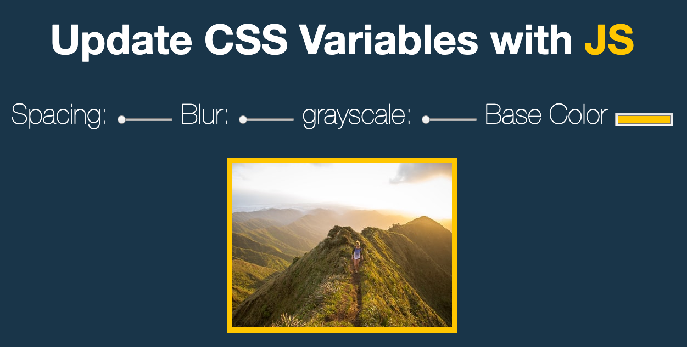

# CSS-Variable



## 主題:

用JS與CSS搭配製作一個即時的濾淨效果， 特效為調整內距、模糊、灰階、邊框色

## 步驟:

### Step1: 
先定義base, default variable, 改變value那css就會改變

```css
:root{
  --spacing: 10px; 
  --base: #ffc600;
  --blur: 10px; 
  --grayscale: 0%;
}
```

> [filter css mdn](https://www.w3schools.com/cssref/css3_pr_filter.asp)

### Step2:
試試看改變img和hl
```css
img{
  padding: var(--spacing);
  background: var(--base);
  filter:blur(var(--blur)) grayscale(var(--grayscale));
}

.hl{
  color: var(--base);
}

```

### Step3:
綁定dom來改變. 使用document.querySelectorAll, 並對每一個input綁定監測事件

監測事件除了綁定change以外, 也要綁定mousemove, 如果只有change事件只會輸出改變後的值, 無法輸出每一次滑動的改變
可以使用callback的handleUpdate查看console.log會更明顯

```javascript
var inputs = document.querySelectorAll('.controls input')

inputs.forEach(input => input.addEventListener('change', handleUpdate))

//若是只有mousemove那這樣顏色就會選不到.
inputs.forEach(input => input.addEventListener('mousemove', handleUpdate))

```
### Step4:

在handelUpdate的function中, 先定要改變的後綴, 沒有px會無法改變. 

```javascript
var suffix = this.dataset.sizing || ''
```

### Step5:

透過Document.documentElement, 來改變已經定義好的根元素. 

> Document.documentElement會回傳目前文件（document）中的根元素（Element）, 這樣效果等同於直接在html裡面加上style. 

```javascript
document.documentElement.style.setProperty(`--${this.name}`, this.value + suffix)
```

## CSS語法&備註

變數命名的規則為：- -變數名稱
可在:root命名變數，變全域的變數，也可在任意的選擇器內命名變數。

### root
這個偽元素匹配的是文檔的根元素，也就是 標籤。常用於聲明全局的 CSS 變量。

document.querySelector(':root') === document.querySelector('html) === 
document.documentElement

這三者都是true. 

## JavaScript語法&備註

### 利用 JavaScript 讀寫 CSS 變數

用function的概念呼叫. 

讀取：getPropertyValue()
寫入：setProperty()

#### 語法:
style.setProperty(propertyName, value, priority);

#### 參數:
propertyName : 一定要有，一個DOMString ，代表被更改的CSS屬性。

value: 一個DOMString，表示新的屬性值。如果没有指定，則當作空字符串。

priority : 一個DOMString 可設置 "important" CSS 優先级。如果没有指定，則當作空字符串。

## 探索
1. 依樣畫葫蘆的新增了grayscale()的效果，
在CSS中要使用兩個以上的濾鏡效果寫再一起就好，
如果分開來的話會變成覆蓋：

```CSS
/* 這樣會變成覆蓋，剩下garyscale的效果 */
img {
    filter: blur(10px);
    filter: grayscale(10%);
}
/* 寫在同一處，才能吃到兩個效果 */
/* 另外把grayscale的max 調大, 否則會看不太到灰階的效果*/
img {
    filter: blur(10px) grayscale(10%);
}
```
2. 以往的作法

```javascript
//這是直接改變畫面. 若是有很多就需要修改. 
function handleUpdate(){
  switch (this.name) {
    case 'spacing':
      document.querySelector('img').style.padding = this.value + 'px'
      break;
    case 'base':
      document.querySelector('img').style.background = this.value
      document.querySelector('.hl').style.color = this.value
      break;
    case 'blur':
      document.querySelector('img').style.filter = `blur(${this.value}px)`
      break;
  }
}
// 也可以改成這樣, 比較潮, 也不會用到dataset, 但是閱讀性差
function handleUpdate(){
  switch (this.name) {
    case 'spacing':
      document.querySelector('img').style['padding'] = this.value + 'px'
      break;
    case 'base':
      document.querySelector('img').style['background'] = this.value
      document.querySelector('.hl').style['color']  = this.value
      break;
    case 'blur':
      document.querySelector('img').style['filter']  = `blur(${this.value}px)`
      break;
  }
  document.documentElement.style['--'+ this.name] = this.value + (this.name === 'base' ? '' : 'px')

}

```

目前網頁的趨勢是透過資料去驅動畫面. 
在以前的做法是把變數存在JS中. 
在此範例中是存在css中. 


[此範例以Alex宅幹嘛的教學和wes bros為主](https://www.youtube.com/watch?v=fIE2Lmfbo4k&list=PLEfh-m_KG4dYbxVoYDyT_fmXZHnuKg2Fq&index=3)