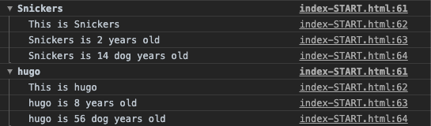
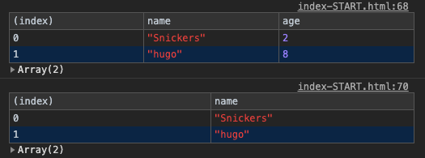
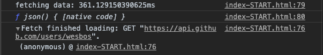

# Dev Tools Domination

## 主題:
介紹Chrome開發工具中DOM break及各種console的格式
今天的內容也是相對的輕鬆, 底下就跟著我一起試試看吧

## DOM break

這是在console裡面查看break, 就是在DOM上按下右鍵, Break on -> attribute modification


## Console.things

方便看到訊息的封裝
```javascript
let console = {
    isDev: true, // 上線時可以調成false
    log(...args){
        if(!this.isDev) return 
        window.console.log(...args)
    }
}
```

### 1. console.log()

這就不多介紹拉～～

`console.log('hi')`

### console.log('%s', value)
後面的字串會移動到前面  

`console.log('Hello I am a %s string!', '💩');`
%s是string的意思, 現在都改用ES6的template string

### console.log('%c', font-style) (不知道這何時會用到...)


### 4. console.warning()


### 5. console.error()


### 6. console.info()
顯示為資訊圖示, 不知道要用在哪@@

### 7. console.assert()

#### assert(斷言) https://zh.wikipedia.org/wiki/%E6%96%B7%E8%A8%80_(%E7%A8%8B%E5%BC%8F)

正確的話, 不會log出什麼
`console.assert( 1 === 1, 'that is wrong!')` 

錯誤的話, 才會出現後面的字串, 並且提示Assertion failed. 

`const p = document.querySelector('p');
console.assert(p.classList.contains('ouch'), 'That is wrong!');` 

像是這樣


### 8. console.clear()
這還蠻好用的, 有時候就不用把console.log給刪掉了, 直接下這個指令全部都刪除.

> 補充：Mac上清除的快捷鍵為⌘(Command)+K

### 9. console.dir()

可以顯示選取物件的所有屬性，
我寫的這個範例中，console.log(test)只能返回test本身的function內容，
若使用console.dir(test)則可以印出test本身及其所擁有的屬性（注意屬性第一行run）。


### 10.console.groupCollapsed() & console.groupEnd()

群組的概念, 可以把輸出資訊透過group包起來。
但是我覺得在console也不太會操作到這些, 要操作直接在網頁上就好了

```javascript
  dogs.forEach(dog => {
    console.groupCollapsed(`${dog.name}`);
    console.log(`This is ${dog.name}`);
    console.log(`${dog.name} is ${dog.age} years old`);
    console.log(`${dog.name} is ${dog.age * 7} dog years old`);
    console.groupEnd(`${dog.name}`);
  });
```


補充下`console.table()`

如果我只想要看一個屬性, 可以改成只秀出特定欄位
`console.table(dogs, ['name'])`




### 11. console.count()

就是可以看出第幾次呼叫, 這個應該也不太會用到


### 12.console.time() & console.timeEnd()
可以算出區域內執行的時間, 例如可以查看api response回來需要多久

```javascript
console.time('fetching data')
fetch('https://api.github.com/users/wesbos')
  .then(data => data.json)
  .then(data => {
    console.timeEnd('fetching data')
    console.log(data)
  })
```


get使用時間: 361.129xxxx 毫秒

在一般的網頁上也有performace now()的的用法

---

想看更多，請參考六角學院  

[六角學院- Chrome網頁除錯功能大解密](https://www.udemy.com/course/chrome-devtools/)

---

[此範例以Alex宅幹嘛的教學和wes bros為主](https://www.youtube.com/watch?v=sWBSxMVMbjc)