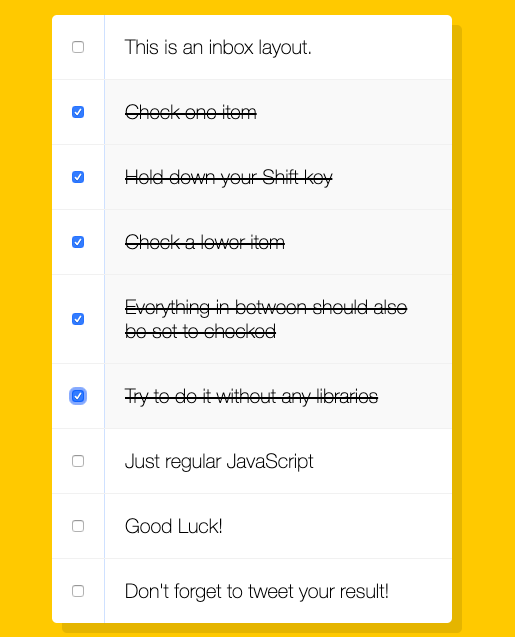

# Hold Shift to Check Multiple Checkboxes



## 主題:

點選第一個checkbox, 並按住shift, 再點選第一個以下的checkbox, 則會把從第一個到第二個的checkbox都做出選取. 

這邊有兩種方法, 我一開始是想到alex的作法, 但是實在太弱所以無法實現出來

## 程式備註from Wes bos

```javaScript
//選取所有的checkbox
const checkboxes = document.querySelectorAll('.inbox input[type="checkbox"]');
let lastChecked;

function handleCheck(e) {
    let inBetween = false;
    // 檢查是否按著shift點選
    if (e.shiftKey && this.checked) {
        checkboxes.forEach(checkbox => {
        // 當前點選的checkbox開始記錄到最後一個點選的checkbox關閉標記
        if (checkbox === this || checkbox === lastChecked) {
            inBetween = !inBetween;
            console.log('STarting to check them inbetween!');
        }
        // 勾選區間內為true的checkbox
        if (inBetween) {
            checkbox.checked = true;
        }
        });
    }
    lastChecked = this;
}
// 為每個checkbox加上click事件
checkboxes.forEach(checkbox => checkbox.addEventListener('click', handleCheck));

```

## 程式備註from Alex

```javaScript
    const checkboxs = Array.from(document.querySelectorAll('input'))
    checkboxs.forEach(checkbox => checkbox.addEventListener('click', handleClick))
    
    // 功能是要按區間, 所以第一個按了, 第二個才是要按區間
    // 沒有第一個就沒有第二個, 相對的就沒有區間. 
    // 是要一個區間, 當紀錄了一個區間(firstCheck), 使用者點了一個尾(lastCheck), 那這區間就秀出來了
    let firstCheck = null

    function handleClick(e){
      if(this.checked){
        // 要把區間勾起來, 要滿足兩個條件
        // 1. shiftkey要按住, shiftkey = true
        // 2. 上一個是要被點選到的, 不可以沒有上一個選擇
        if(e.shiftKey && firstCheck !== null){
           let secondCheck  = checkboxs.indexOf(this)
           checkboxs
            .slice(
              Math.min(firstCheck, secondCheck),
              Math.max(firstCheck, secondheck)
           ).forEach(input => (input.checked = true))
        }
        firstCheck = checkboxs.indexOf(this)
      }else{
        firstCheck = null
      }
    }
```

[此範例以Alex宅幹嘛的教學和wes bros為主](https://www.youtube.com/watch?v=tYBwiyjC_6A)