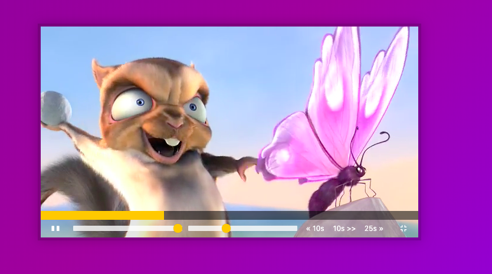
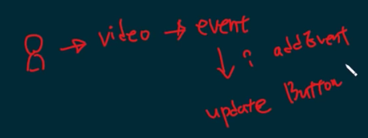

# Custom Video Player



## 主題:

介紹如何使用HTML5的video tag來完成各種播放器功能，
播放/暫停、快進/快退、音量控制、速率控制等...

### 播放/暫停功能

這部分其實用video.pasued來判斷就好了, 我一開始卡在video.playing
遲遲無法有新進展, 睡覺的時候想者, 我只要有一個判斷式就可以做了啊, 在傻什麼....

所以寫了三種風格


```javascript
//三元運算子
viewer.paused ? viewer.play():viewer.pause()

// if/else
if(viewer.paused){
    viewer.play()
}else{
    viewer.pause()
}

// swith case
// 用switch蠻像脫褲子放屁的, 因為條件只有兩個啊...

const action = viewer.paused

switch(action)
    case 1:
      video.played()
      break; 
    case 2: 
      video.paused()
      break; 
    default;
      break
```

### 改變播放和暫停的按鈕

這邊他用的方法, 和我想的不太一樣
```javascript
//我這邊一樣式是監聽有沒有暫停, 有的話我就return新的innerText
    if(viewer.paused){
        return toggles.innerText = '||'
    }else{
        return toggles.innerText = '►'
    }
// 他用的手法是要監聽這個影片是不是在播放, 所以要先下兩個addeventlister

viewer.addEventListener('play', updateButton)
viewer.addEventListener('pause', updateButton)

// function裡面則是拿來控制的按鈕,寫法蠻高級, 而且三元運算子在給定一個變數命名, 這部分也可以學習一下

function updateButton(){
    const icon = this.paused ? '►' : '❚ ❚';
    toggle.textContent = icon
}

```
看了alex的直播, 他講到這個觀念, 就是低耦合, 耦合就是不要同時改變, 我在控制video的時候, 不一定要改變同時改變icon的圖示, 這兩件事是可以斷開的



誰去改變影片狀態 => toggle play
誰去改變按鈕 => 影片的事件會改變畫面


### 播放速度和音量改變

這兩個的操作都蠻像的, 所以寫在一起
一開始就是監聽事件. 因為class都寫的一樣. 
所以我是用input裡面的name來監聽

```javascript
const sound = document.querySelector('input[name="volume"]')

//實作部分就是參考網路上的寫法
viewer.volume = sound.value/1
```

wes bos的寫法是:
在javascript的部分，ranges是透過querySelectorAll來取得的， 所以可以用forEach來把所有range加上addEventListener， 也因為range是拖曳條，除了click外，也必須要監聽mousemove， 而name的命名volume與playbackRate也就是video本身的屬性，直接使用。

```javascript
function handleRangeUpadte() {
  video[this.name] = this.value;
}
ranges.forEach(range => {
  range.addEventListener('change', handleRangeUpadte);
  range.addEventListener('mousemove', handleRangeUpadte);
})
```

但這邊有講到一個觀念,就是透過中括號達成屬性的使用

有使用video[method]()的方法來操作屬性，
其實相關的操作方法就等同於video.play()，但不能寫成video.method()，
因為這樣就變成呼叫video底下的function method了，
所以使用中括號[]包起來的會自動變成字串，可以避免掉這樣的問題。


### 前進後退10s, 25s

因為html也是寫死的, 所以我這邊用了`querySelectorAll`和`forEach`的作法來監聽, 現在是可以監聽拉, 但是之後怎麼做又沒有頭緒了...

看了下wesbos一點點以後, 我又稍微推敲了下, 現在可以惹！！
用這兩種方法都正確, 錯誤的是我不應該用`class`來選擇

透過這樣就可以選到data-skip

```javascript
const skipButton = document.querySelectorAll('[data-skip]')

skipButton.addEventListener('click', updateButton)

function handleButton(){
    console.log(this.dataset.skip) // 這樣就可以拿到數值了
    //本來我想要用number包起來, 但是課程是用parseFloat
    viewer.currentTime += parseFloat(this.dataset.skip)
}

```

[要用parseFloat的原因?](https://stackoverflow.com/questions/12227594/which-is-better-numberx-or-parsefloatx)

```javascript
//這範例就可以看出來,哪一個比較好惹..
parseFloat('1x'); // => 1
Number('1x'); // => NaN

parseFloat('0x10'); // => 0
Number('0x10'); // => 16

parseFloat(''); // => NaN
Number(''); // => 0
```
alex補充, 如果想要在畫面上再加上快進10秒, 複製html就可以了！

### progressbar調整, 讓播放的畫面和進度條是同步的

一開始的探索是想說我先拿到現在的style就好了, 
查了老半天才知道, 原來寫在css的是沒有辦法拿到的
能拿到的只有`inline-style`, 例如像這樣

```javascript
console.log(e.target.style.width)
```
要拿到寫在css的有四種方法, 不多贅述, 有空再看補充

> [原生js獲取dom元素css樣式的四種方法及對比](http://www.lingwuya.com/2018/03/20/%E5%8E%9F%E7%94%9Fjs%E8%8E%B7%E5%8F%96dom%E5%85%83%E7%B4%A0css%E6%A0%B7%E5%BC%8F%E7%9A%84%E5%9B%9B%E7%A7%8D%E6%96%B9%E6%B3%95%E5%8F%8A%E5%AF%B9%E6%AF%94/)

這部分我要大方的承認我卡住, 但我拿到一個關鍵, 就是要改變flex-basis. 

目前想到的作法是塞入新的style屬性, 我現在才知道原來`setAtribute`是
用來改變html的屬性, 然後這個方法需要有兩個參數, 一個是屬性名稱, 一個是改變的值. 

我想到了一個偷甲步的方法
```javascript
progressbar.setAtribute('style', `flex-basis:${xxx}%`)
```
這邊wes bos的寫法是. 
```javascript
function updateProgress(){
    const percent = (video.currentTime / video.duration) * 100 
    progressbar.style.flexBasis = `${percent}%`
}
```
可以透過前進後退, 來確認現在的畫面和進度條是否一致

### 點選progressbar位置, 畫面也會調整到相對的位置

這邊一開始要監聽`progress`, 透過`e.offsetX`取得位置, 但還不是整體影片中的位置, 所以要再做一點轉換, 才會拿到整個影片確切的位置

```javascript
function drag(e){
    // (點到的位置/整體影片的長度)*整體影片的播放時間
    const dragTime = (e.offsetX / viewer.offsetWidth) * viewer.durationTime
    viewer.currentTime = dragTime
}
```
但是只有偵測mousemove是不夠的
我們只要讓滑鼠在進度條上移動
就會影響其長度
因此用一個變數mousedown來存取mouse的狀態
預設是false
並偵測滑鼠點下與放開

```javascript
let mousedown = false;
progress.addEventListener('click', scrub);
progress.addEventListener('mousemove', (e) => mousedown && scrub(e));
progress.addEventListener('mousedown', () => mousedown = true);
progress.addEventListener('mouseup', () => mousedown = false);
```

alex 判斷式的省略筆記

```javascript
// 當aaa是true才會做bbb
aaa && bbb 
```
```javascript
// 當aaa是false才會做bbb
aaa || bbb 
```
### 全螢幕
作者最後有提到的小功能，他說留給我們自己去研究。
首先在HTML中加上對應的功能按鈕與圖標(就是這個放大圖標讓我去用font-aswsome的XD)
```html
 <button class="player__button fullscreen"><i class="fas fa-compress"></i></button>
```

然後再javascript中加入這段，多個判斷是為了不同的瀏覽器而寫， 值得一提的是，不用對取消全螢幕特別做處理，預設就會有esc關閉及對應的關閉icon了， 但如果有特別需求可以使用exitFullscreen()來關閉。

```javascript
function fullScreen() {
  if (video.requestFullscreen) {
    video.requestFullscreen();
  } else if (video.msRequestFullscreen) {
    video.msRequestFullscreen();
  } else if (video.mozRequestFullScreen) {
    video.mozRequestFullScreen();
  } else if (video.webkitRequestFullscreen) {
    video.webkitRequestFullscreen();
  }
}
```

[mdn-fullscreen](https://developer.mozilla.org/zh-TW/docs/Web/API/Fullscreen_API)

## 結論:

alex說整體來說, 這個範例很多作法都做的很精巧, 也很值得學習. 但是如果本身沒有要客製化開發的話, 其實
control就很夠用了

[此範例以Alex宅幹嘛的教學和wes bros為主](https://www.youtube.com/watch?v=gS4RJkcEyPo#t=10m25s)

[影片相關屬性和方法](http://www.lucklnk.com/godaddy/details/aid/790350379)