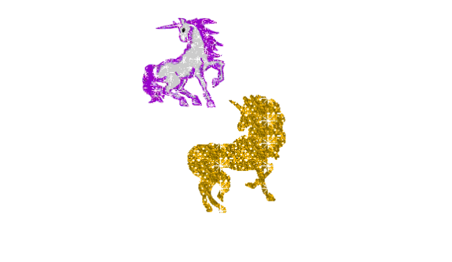

# Key Sequence detection 



## 主題:

今天很有趣, 就是埋彩蛋.

## 程式備註from Alex

### 比較陣列中的字串

所以先從陣列轉字串

```javaScript
  const secretCode = [38, 38, 40, 40, 37, 39, 37, 39, 66, 65]
  const input = []

  window.addEventListener('keyup', (e) =>{
      input.push(e.keyCode)

      while(input.length > secretCode.length){
         input.shift()
         console.log(input) // 移除陣列的第一個元素, 確保陣列的長度等於10
      }

      if(input.join(',') === secretCode.join(',')){
        cornify_add()
      }
  })
```

### 解析wesbos的作法

```javaScript
  const secretCode = [38, 38, 40, 40, 37, 39, 37, 39, 66, 65]
  const input = []

  window.addEventListener('keyup', (e) =>{
      input.push(e.keyCode)

      // wesbos的寫法
      // input.splice(-secretCode.length - 1, input.length - secretCode.length);
      // 前面是負數, 基本上就是0, 所以可以看成
      // input.splice(0, input.length - secretCode.length);    
      // 這樣的做法就等於底下

      while(input.length > secretCode.length){
         input.shift() 
      }

      if(input.join(',') === secretCode.join(',')){
        cornify_add()
      }
  })
```

## 結論
再用別人的library的時候, 常常會有搞不清楚的問題, 最好是可以自己寫,這邊會出現一些bug, 就是會一直增加icon
但其實不用管, 因為效果出來拉～～


[此範例以Alex宅幹嘛的教學和wes bros為主](https://www.youtube.com/watch?v=hY5JxUquoXM)