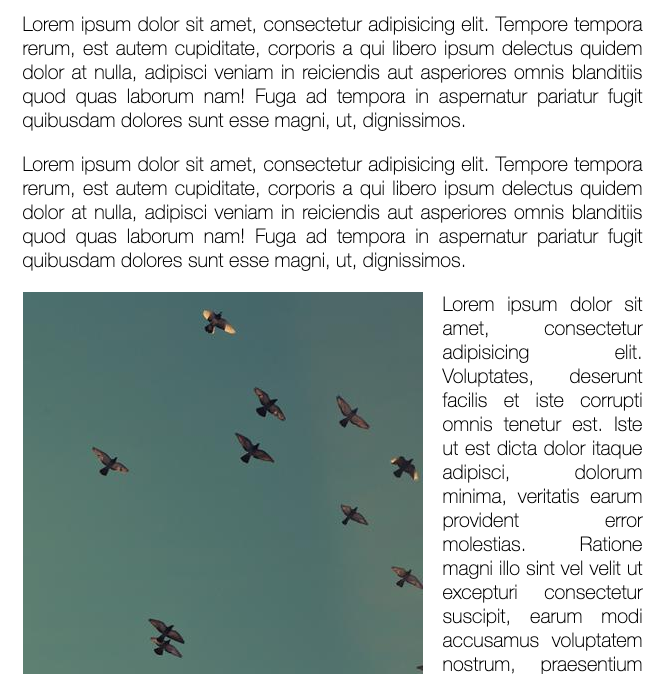

# slide scroll



## 主題:

偵測捲軸的事件, 來顯示圖示
這個觀念就是要了解捲軸的事件和方法.
例如:scrollY, innerHeight, offsetTop 等等

## JavaScript語法&備註

### scroll event
scroll事件是一個連續觸發的事件. 不管是用拖曳或是滑鼠移動都會觸發.
而debounce是希望把連續觸發的事件做等待的動作.
加debounce是為了增加效能, 而不要因為scroll而做到重複觸發.

```
debounce(wait = 20sec, immediate = true => 是否要直接做?)
```
而debounce可以包在function的外層
```JavaScript
window.addEventListener('scroll', debounce(scrollHandler, 100))
```

### mouseWheel event
裝置如果沒有滑鼠滾輪, 就沒辦法觸發這個效果

### window.scrollX

通常用在新聞網站中, ex: 蘋果橫向捲軸

### window.scrollY

捲軸往下1px, 內容就會往上1px. 

### window.scollTo(x,y)

如果要同時設定x,y可以用這個設定

### windowTop = window.scrollY

windowTop 可以看成頁面的最上層那一條邊線

### windowBottom = window.scrollY + window.innerHeight(頁面的高度)

windowBottom 可以看成頁面的最下層那一條邊線
而這個邊線主要就是最上一層再加上頁面自己的高度

### offsetTop 
可以看成這個圖示自己本身高度的最上一層

## 實作部分

當頁面滑動, 超過圖片的上緣, 顯示圖片
但是這樣動畫出現太少了, 所以通常會拿肚子來做

```JavaScript
    // 最終程式碼
    function scrollHandler(){
      console.log('scroll', new Date().getTime())
      let windowTop = window.scrollY
      let windowBottom = window.scrollY + window.innerHeight

      let images = document.querySelectorAll('img')
      images.forEach(item => {
         let itemMiddle = item.offsetTop + item.height / 2 
         if( itemMiddle < windowBottom && itemMiddle > windowTop){
            item.classList.add('active')
         }else{
           item.classList.remove('active')
         }

      })

    }

    window.addEventListener('scroll', scrollHandler)

```

## debounce 分析

```JavaScript
    function debounce(func, wait = 20, immediate = true) {
      var timeout;
      return function() {
        var context = this, 
            args = arguments;
        var later = function() {
          timeout = null;
          if (!immediate) func.apply(context, args);
        };
        var callNow = immediate && !timeout;
        clearTimeout(timeout);
        timeout = setTimeout(later, wait);
        if (callNow) func.apply(context, args);
      };
    }

```

### call vs apply

- call就像電話號碼一個一個按
- apply是整包給

## 閉包(clousre)

```JavaScript
// 範例 1 
let count = function (num){
   let count = num

   return function(){
      console.log(++coumt)
   }
}
let c1 = count(0)

c1() // 1
c1() // 2
//參數只封閉在這個function裡面, 沒有人可以去修改他, 只能透過function呼叫
```

```JavaScript
let test1 = function (num){
   let count = num

   return function(){
       plus(){
         console.log(++num)
       }, 
       get(){
         console.log(num)
       }
   }
}
let t1 = test1(0)
t1.get() // 0
t1.plus() // 1

// 設計放在這個封閉區間裡面, 而只設計了兩個方法給他用
```

### debounce vs throttling vs lazy load

debounce: 停留多久執行一次  
throttle: 至少多久執行一次

```JavaScript
;(function(){
  $(window).scroll(function(){
    // jquery的index要擺在前面
    // this.就不能用箭頭函式
    $('img').each(function(index, img){
       if(
         $('img').offset.top()+ $('img').height()/2 <
         $(window).scrollTop()+ $(window).innerHeight()
         ){
          $(img).append('')
       }
    })
  })
})()

```

[此範例以Alex宅幹嘛的教學和wes bros為主](https://www.youtube.com/watch?v=PRRZlAVvJ7A&list=PLEfh-m_KG4dYbxVoYDyT_fmXZHnuKg2Fq&index=13)