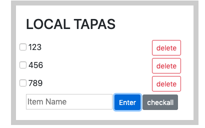

# LocalStorage

就是在本機儲存, 如果換了一台電腦就不行惹.
換機器就不行惹, 這是基本觀念. 

## 主題:



剛才看了下wesbos的範例,其實他只要存在localstorage就好, 結果我除了update以外
都做完了, 可能是看到其他人加上了刪除和click all的作法, 所以我想說我應該也可以做的出來
沒想到直接做完了, 就差在存在local storage中. 

這個練習其實和week18很像, 只是這次我算是憑一己之力把它完成了. 
經過這次的練習, 我發現我的js真的有所進步, 不敢說進步神速但是反應變得好快是真的

總之經過剛才的努力, 我完全知道localStorage要怎麼用惹, 真的覺得很爽！！


## JavaScript語法&備註

### submit event 

透過form傳送資料的話是要監聽`submit`事件, 另外要加上`e.preventDefault()`否則字串就會放在網址後面傳送到後端
但是這個範例只要在前端操作就好.

### 選取器
```JavaScript
console.log(e.target)
// 出來後
<form class="add-items">
   <input type="text" name="item" placeholder="Item Name" required>
   <input type="submit" value="+ Add Item">
</form>
```

```JavaScript
// 所以直接往下選就好惹... 好高招喔！！
function addItem(e){
   let value = this.querySelector('input:first-child').value
   let value = this.querySelector('[name = item]').value
}

```

### reset 

這個不確定是不是要和submit連用, `this.reset()`, 這是要對form表做, 透過input做是沒用的

### map方法來取代forLoop 

我自己的寫法是透過組成一個新的str, 再把他透過innerHTML, 放到父層元素底下. 
但是作者透過map的寫法感覺更簡潔了些. 
而且map竟然可以直接傳`i`, 這也太方便惹吧..

```JavaScript
// 這個plates和platesList不知道是指什麼? 作者有講其實這就是items, 因此items === plates, itemsList === platesList
// 這樣做可以更彈性, 哇賽!

function render(plates = [], platesList){
   platesList.innerHTML = plates.map((plate, i) => {
      return `
         <li>
            <input type="checkbox" data-index=${i} id="item${i}" ${plate.done ? 'checked' : ''}/>
            <label for="item${i}">${plate.text}</label>
         </li>
      `
   }).join('')// 因為map回來也是陣列, 這樣做是讓他變成字串
}

```
## LocalStorage

```JavaScript
localStorage.setItem('items', JSON.stringify(items));
```
這裡將items的資訊存在localStorage中一個叫做items的自訂物件中，
注意的是存入的物件或陣列必須透過JSON.stringify轉為字串，
因為localStorage中的值是string，否則直接存只會得到”object object”的字串。

接著修改最一開始宣告的items:

```JavaScript
// 要很清楚這items會是什麼東西, 那如果沒有呢? 就變成undefined, 所以會在後面 || []
// 前面是false, 就會走後面. 
const items = JSON.parse(localStorage.getItem('items')) || [];
```
這邊有一個重點, 就是我在最後還要render一次, 這樣資料才會跑進去
```JavaScript
render(items)
```
這邊還有一個重點就是我不管做什麼dom的操作, 例如刪除或是修改狀態, 我都要同時做這兩行

```JavaScript
localStorage.setItem("todo", JSON.stringify(items));
render(items)
```
為什麼? 
因為我要確保現在render的東西是最新的

## 事件代理

這邊我和作者的做法不一樣, 但是他的寫法比較好
我的作法是因為我把`checked`先放在`render()`裡面了
所以可以在外部呼叫, 而且我結構也改變了
根本沒有ul這個東西... 

```JavaScript
function toggleDone(e) {

  // 偵測進來的點擊是input(checkbox)才動作
  if (!e.target.matches('input')) return;
  // 取得checkbox的data-index值
  const el = e.target;
  const index = el.dataset.index;
  // 利用！來使done的狀態在true/false間切換, 這一步很高竿, 因為我是用if/else來切換
  items[index].done = !items[index].done;
  // 將更新後的狀態寫入localStorage中
  localStorage.setItem('items', JSON.stringify(items));
  // 更新列表
  populateList(items, itemsList);
}
// 監聽click
itemsList.addEventListener('click', toggleDone);

```


## alex補充

snippet? 

### cookie 

### LocalStorage
5~10m 的大小
不能記物件, 只能記字串, 所以要先`stringly`把它轉成字串

localStorage是跨視窗可以用的,而且是認key的, 所以如果同時開了兩個視窗A,B. 
那就會共用.

### sessionStorage
單次執行, 當關閉瀏覽器的時候, 就消失了
和後端session的差別就是一個存在本地端, 一個存在sever
大家不喜歡用session是因為會佔server的資源

#### 以上這些都有容量的限制, 所以可以用資料庫儲存大量資料

### indexedDB

### webSQL 
已經不再維護

### match vs matches 

string => match 
element =>  matches 

這邊會提到matches是因為要做代理事件, 要選到target的的checkbox

### e.target vs e.currentTarget 
再透過事件代理判斷時, 可以用這個判斷到底選到是那一個.
是父層的元素? 還是子層的元素?

[此範例以Alex宅幹嘛的教學和wes bros為主](https://www.youtube.com/watch?v=gWpBTV7ihE4#t=23m)