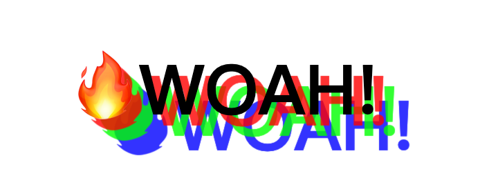

# mouse move shaow

這效果我實在不是很想用,但是了解一下也好



## 主題:
簡單來說是做move的偵測

## JavaScript語法&備註

clientX, 頁面
clientY, 頁面

offsetX, DOM
offsety, DOM

但是如果有多層的話, 會依照滑鼠點選位置的外框來算offsetX, offsetY
所以要補一段高度回去. 

解構: 

```JavaScript
// No1: old school 
let x = e.offsetX
let y = e.offsetY

// No2: new school, 拆滑鼠座標, 順便給變數
let {offsetX, offsetY} = e

// No3: 最潮的
let {offsetX: x, offsetY: y} = e

// 這一步就可以看出, 當我滑鼠移到中間的時候, 不是接近50%,50%, 是因為原本是用
// 左上角當作定位的地方, 改成變成裡面那一層的左上角定位
console.log(
    offsetX / this.offsetWidth, 
    offsetY / this.offsetHeight
)


// x是對左右, y是對上下
if(e.target !== this){
    offsetX = e.target.offsetLeft
    offsetY = e.target.offsetTop
}

// 最後就是來改寫text-shadow的效果

let length = 100 
let text = document.querySelector('h1')

let lengthX = 
    Math.floor((offsetX/ this.offsetWidth) * length) * 2 -length
let lengthY =
    Math.floor((offsetY / this.offsetHeight) * length) * 2 -length

text.style.textShadow = `
    ${lengthX * -.3}px  ${lengthY * -.3}px  1px rgba(255, 0, 0, 0.8),
    ${lengthX * -.6}px  ${lengthY * -.6}px  1px rgba(0, 255, 0, 0.8),
    ${lengthX * -1}px  ${lengthY * -1}px  1px rgba(0, 0, 255, 0.8)
    `
})


```

### 其他補充:

如果cb, 用了arrow function.  那就不能用this, 只能用e.currentTarget

```JavaScript
const hero  = document.querySelector('.hero')
hero.addEventListener('mousemove', (e)=>{
    console.log(e.target, e.currentTarget)
})

```


## 探索
 
這個範例:

1. mousemove的功能, 了解裡面的`offsetX`, `offsetY`
2. offset的計算
3. 多層次的座標的概念


[此範例以Alex宅幹嘛的教學為主](https://www.youtube.com/watch?v=3862i0RdKLU&t=6m51s)