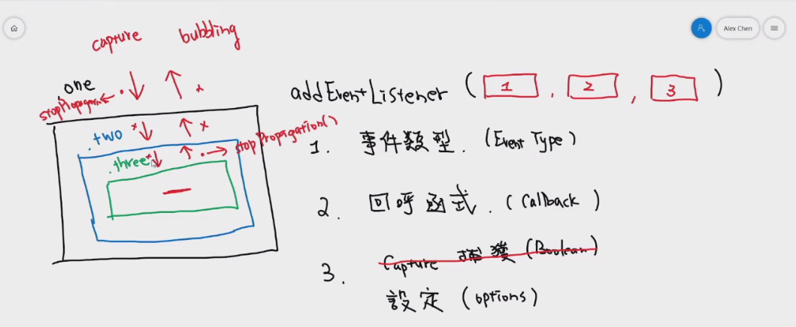

#  Event Capture, Propagation, Bubbling and Once, delegation

## 主題:

今天就是複習基本的捕獲和冒泡事件. 另外也補充了once的用法, 就是再監聽事件中只能點選一次. 
另外也在對事件委派做更進一步的補充.

## JavaScript語法&備註

```JavaScript
btn.addEventListener('click', buttonHandler, {capture:true, once:false})
```
我發現其實true or false 就是透過capture來判斷的, 我設定false, 其實是capture: false, 那就是冒泡事件. 

```JavaScript
stopPropagation();
```
目的就是在第一次觸發以後就會讓path結束, 阻擋在這條路上其他的偵聽. 



## event delegation 事件委派

一般來說在做的是事件綁定. 但是如果是新增的動態按鈕, 那可能就沒辦法及時加入了.

一般綁定吃的就是`e.currentTarget`, 而事件委派吃的就是`e.target`

所以這時候就可以透過事件綁定來判斷他的nodeName或是nodeText來觸發.
nodeName是判斷出來的東西是大寫.
```JavaScript
nodeName === 'A'
``` 
另外就是假如在委派事件底下有很多東西要找, 如何透過class查找? 

```JavaScript
// 提供兩種方法, 我自己會用第一種
e.target.classList.contains('button')

// e.path出來會是一個陣列, 而return dom.classList是因為有些dom是沒有classList要讓它加上
// e.path在firefox/Safari是沒有的, 所以可以改成e.composedPath()
e.path.find(dom => {
    return dom.classList && dom.classList.contains('button')
})

e.composedPath().find(dom => {
    return dom.classList && dom.classList.contains('button')
})
```


好處有兩個點: 
1. 掌控事件範圍
2. 控制新增或刪除的對象

什麼狀況下不可以用delegation? 
1. mousemove 多次觸發
2. focus/ blur 沒有冒泡事件

壞處的話: 
硬要講缺點是判斷. 

## alex補充

捕獲模式就像警察抓小偷, 是由外到內破門而入.
氣泡模式就像泡澡, 呼氣由內而外. 

就看你在乎外層或是內層

--- 
另外在第三個參數, 也可以傳遞`passive: true`, 這樣會讓原本透過`e.preventDefault()`來阻止dom事件的行為無效.
> passive: A Boolean indicating that the listener will never call preventDefault(). If it does, the user agent should ignore it and generate a console warning.

---

在上面事件委派的例子中, ul的currentTaregt是綁定事件的那個人, a則是e.target, 也就是觸及最深的那個人


[此範例以Alex宅幹嘛的教學和wes bros為主](https://www.youtube.com/watch?v=wfTR8GJu05Q&list=PLEfh-m_KG4dYbxVoYDyT_fmXZHnuKg2Fq&index=25)