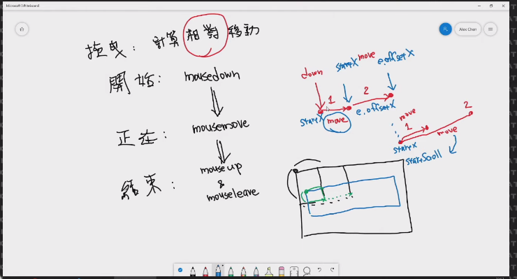

# Drag



## 主題:

實做出拖曳效果, 這個作法先知道沒有深究, 有需要再來研究.

## CSS語法&備註

```CSS
決定立體感
perspective: 500px
```

## JavaScript語法&備註

一般來說用pageXY, clientXY(拿整頁) ,offsetXY(算區域內容)

```JavaScript
    // 第一種作法
    const list = document.querySelector('.items')
    let startX = 0; 

    const startDrag = function(e){
        list.classList.add('active')
        startX = e.pageX 
    }

    const dragHandler = function (e) {
        if(list.classList.contains('active')){
            let move = e.pageX - startX
            startX = e.pageX
            list.scrollLeft -= move * 5
        }
    }

    const stopDrag = function () {
      list.classList.remove('active')
    }

    // 第二種作法
    const list = document.querySelector('.items')
    let startX = 0; 
    let startScroll = 0; 

    const startDrag = function(e){
        list.classList.add('active')
        startX = e.pageX 
        startScroll = list.scrollLeft
    }

    const dragHandler = function (e) {
        if(list.classList.contains('active')){
            let move = e.pageX - startX
            list.scrollLeft = startScroll - move * 5
        }
    }

    const stopDrag = function () {
      list.classList.remove('active')
    }

```

## 探索

1. 手勢判斷
2. click事件擋住, 但是拖曳事件保持完整


[此範例以Alex宅幹嘛的教學和wes bros為主](https://www.youtube.com/watch?v=Opw1XH2eGb4&t=7s)